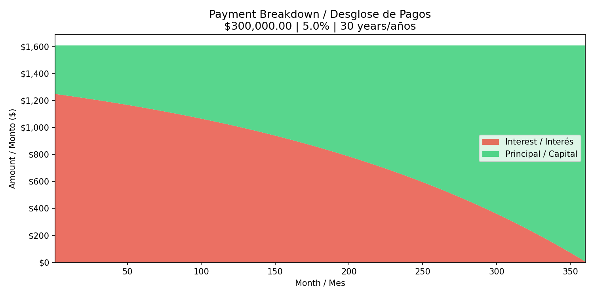

## What does the program do? / Que es lo que hace el programa?
- The program takes the basic data of an amortized loan, such as the principal, interest rate, and how long it's meant to be paid for, and breaks it down for the user.
- El programa toma los datos basicos de un prestamo amortizado, como el principal, la tasa de interes, y el plazo de tiempo en la cual debe ser pagado, y lo desglosa para el usuario.

## Why did I make it? / Porque lo cree? 
- I have a Bachelor's Degree in Banking and Finance, and I want to become a data analyst dealing with financial data. To do this, I have to show my prowess when it comes to creating scripts in Python, and creating code to show a user a breakdown of their amortized loan is a good way to do it.
- Tengo una licenciatura en banca y finanzas, y quiero ser un analista de datos relacionado con datos financieros. Para hacer esto, necesito demostrar mi capacidad en crear codigo en Python, para demostrar a un usuario un desglose de su deuda amortizada.

## Features / Características
- Bilingual output (English/Spanish) / Salida bilingüe (Inglés/Español)
- Input validation for all fields / Validación de entrada para todos los campos
- Formatted amortization table / Tabla de amortización formateada
- Loan summary with totals / Resumen del préstamo con totales
- Payment breakdown chart (saved as PNG) / Gráfico de desglose de pagos (guardado como PNG)
- Payment breakdown file (saved as CSV) / Archivo del desglose de pagos (guardado como CSV)

## Requirements / Requisitos
- Python 3.8 or higher / Python 3.8 o superior
- tabulate
- matplotlib
- csv
- os

## How to Run / Cómo Ejecutar
1. Install dependencies / Instalar dependencias:
   pip install tabulate matplotlib
2. Run the script / Ejecutar el script:
   python amortization.py
3. Enter loan amount, interest rate, and term when prompted.
   Ingrese el monto, tasa de interés, y plazo cuando se le solicite.
4. Tendra una opcion si quisiera obtener una grafica para ilustrar el prestamo. Ingrese y o n para hacer su decision.
   You will be faced with the option to acquire a graph to illustrate the loan. Input y or n to make your decision.
5. Tendra una opcion si quisiera obtener una archivo CSV del desglose del presatmo. Ingrese y o n para hacer su decision.
   You will be faced with the option to acquire a CSV file about the breakdown of your loan. Input y or n to make your decision.

Sample output:
